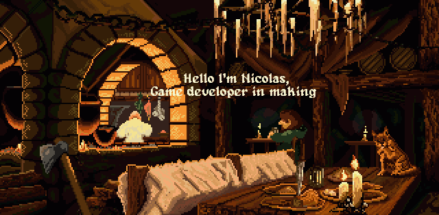

 

---
 

 :man: About me 

 

- :fr: I'm a french student from Reunion Island 
- :mortar_board: Student in 3rd year at Epitech
- :video_game: Love video games and programming

 

---

 :point_down: Click me 

 
  

    
    
        
    
  

 

---

 :fire: My competences 

 

 :video_game: Game Development 

 
 

 :computer: Web Development 

 
 

 :ok_hand: Others 

 
 

 

---

 :pushpin: Some projects 

 

<!--  -->

---

 :clock3: In the last 30 days 

 

 
 

 

---

 :chart_with_upwards_trend: Stats 

 

 

 

---
