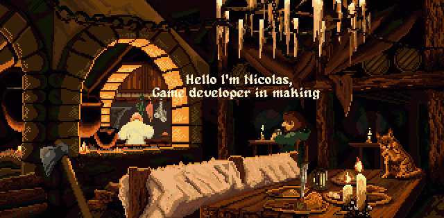

 

<!--  -->

<!-- --- -->
 

 :man: About me 

 

- :fr: I'm a french dev from Reunion Island 
- :mortar_board: 5th year Alumni at Epitech
- :snake: Former member of Epitech's Cobras to teach others my passion of programming
- :video_game: Love video games and programming
- :runner: Also love sports especially judo
 

 :mag_right: Detailed about me 

 

Junior software engineer passionate about low-level programming, 3D rendering, and embedded systems. Graduated from Epitech in 2025 with a specialization in Software Engineering and a year abroad at Keimyung University in South Korea.
 
I have built solid experience in C++ and Rust through academic and professional projects, particularly in XR development, real-time systems, and IoT.
 
I am currently looking for a software developer position, ideally focused on embedded systems, low-level programming, or 3D, in France or abroad.
 

---

 :point_down: Click me 

 
  

    
    
        
    
  

---

 :fire: My competences 

 

 

 :mortar_board: Currently learning 

 

 
 

 :technologist: Software Development 

 
 

 :computer: Web Development 

 
 

 :ok_hand: Others 

 
 

---

 :pushpin: Some projects 

 

 

 

 
 :trophy: Awards and distinctions 

  
 
  - 🏅 Gameplay award : Volcano Game Jam 2022 [(see on itch.io)](https://reboulenicolas.itch.io/sans-nom-le-chevalier)
 
 

<!-- ---

---

 :clock3: In the last 30 days 

 

</a>

 
 

</a>

--- -->

 :chart_with_upwards_trend: Stats 

 

 

 

 

---
